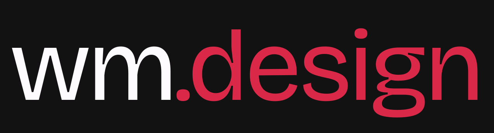

# Hi, I'm   Walter Melo &#128075; </h2>        

## I’m a Front End Developer and Web Designer with 3 years of experience in building intuitive, pixel perfect websites with Webflow. I’m a Javascript specialist with knowledge on diverse development tools and programming languages.

I am a web developer and designer based in Brazil. I started developing at the age of 14 with RPG Maker.
            
Later, around 2017, I got into web development, starting with PHP and Wordpress.
            
Since 2021, I have been working with Webflow and have learned a lot more about design.
            
I strive to build websites that are not only functional but also visually appealing. Currently,
            
I am seeking a full-time position at an agency that values creative coding, where I can learn, grow, and specialize in this niche        

## My Skills.

### Development

- HTML/CSS
- GSAP
- ThreeJS
- React
- Javascript
- Vue
- NodeJS

#### And a little bit of

- Python
- PHP
- Godot
- C

### not-so-common libraries and languages I'm looking into

- Alpine.js
- Racket Programming Language
- HTMX

### Design and No-Code

- Figma
- Webflow
- Framer
- GIMP
- Krita
- Inkscape
- Illustrator

#### No code tools I'm looking into

- Dora
- Spline
- SVGator

### Some Hobbies

- Singing
- Drawing
- Game Development
- Tinkering with exotic programming languages (like Racket)

## Contact

- [Website](https://waltermelo.design/)
- [Linkedin](https://www.linkedin.com/in/walmello/)
- [Twitter](https://twitter.com/waltermelo_)
- [Dribbble](https://dribbble.com/walmello24)
- [Webflow](https://webflow.com/@walmello)
- [Framer Community](https://www.framer.community/u/864860dd)
